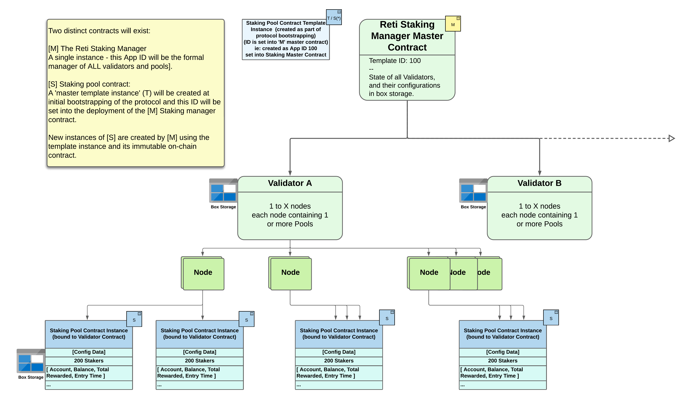
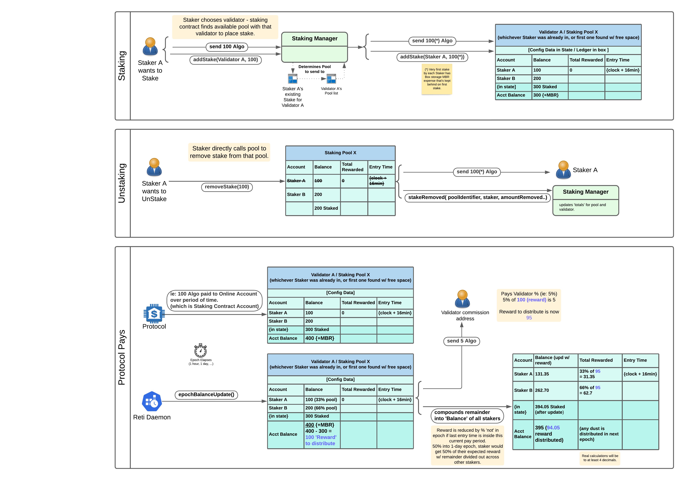
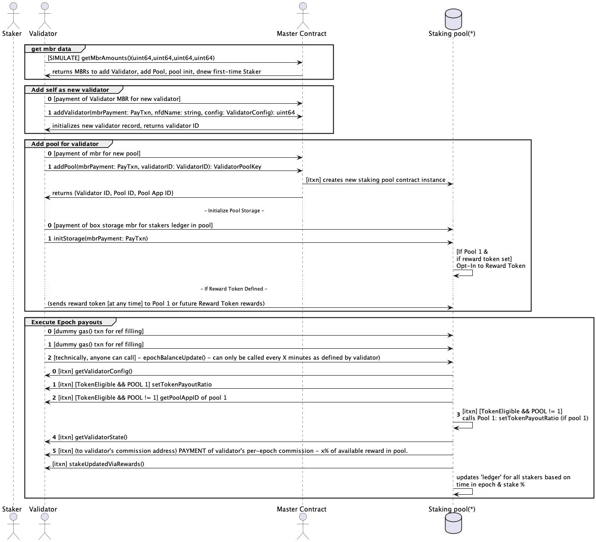
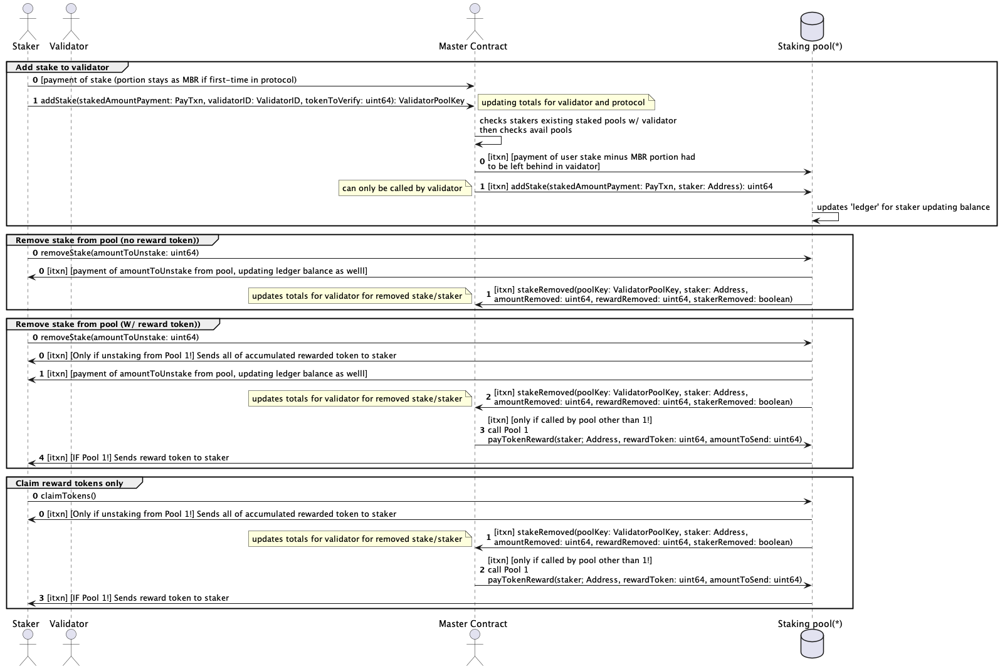

# Smart Contracts

The contracts are written using AlgoKit and TEALScript. &#x20;

The source for Reti, its contracts, node daemon and UI is currently at [https://github.com/TxnLab/reti](https://github.com/TxnLab/reti)

Information on Tealscript can be found [here](https://tealscript.netlify.app/).

See the README in the contracts/ directory for build / testing details.

Some diagrams of the workings are provided here as some may find them useful but the contracts themselves are the best source for complete details.  Not every operation is shown in the sequence diagrams as they would be far too verbose.

<figure><figcaption>
General Overview
</figcaption></figure>

<figure><figcaption>
Basic Operations
</figcaption></figure>

***

## **Validator Operations**

<figure><figcaption></figcaption></figure>

## **Staking Operations**

<figure><figcaption></figcaption></figure>
